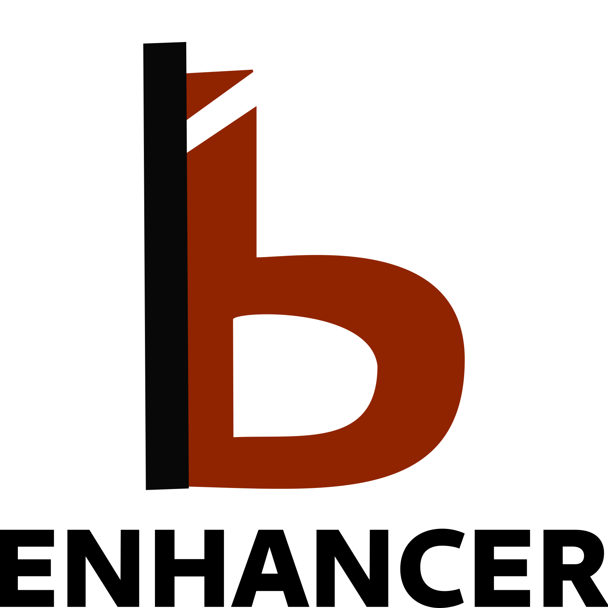
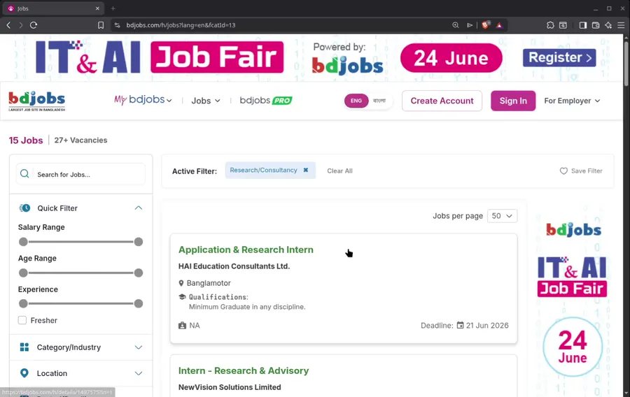
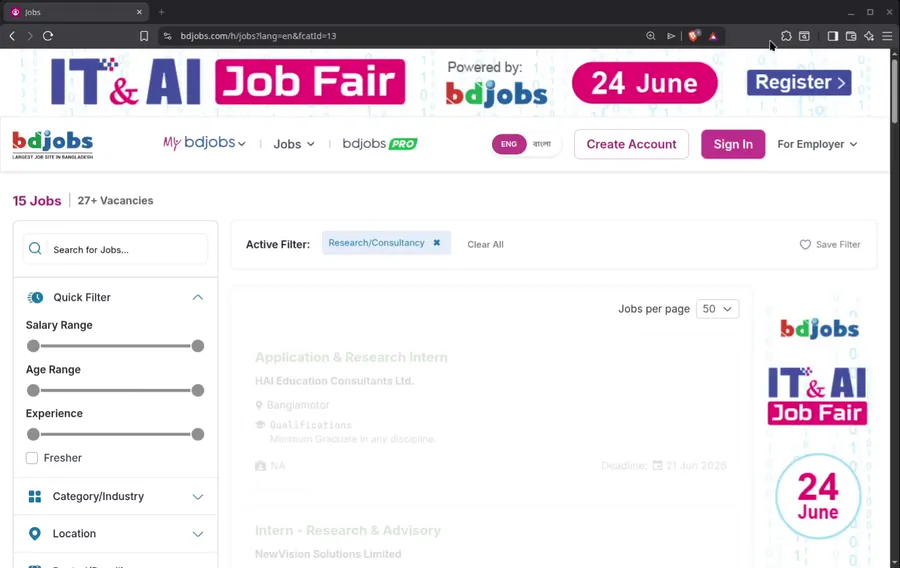

  

# bjobs enhancer

A lightweight browser extension designed to upgrade the user experience on [bdjobs](https://bdjobs.com/)

## Features

* **Hide Job Cards:** Declutter your job list by hiding specific job postings you aren't interested in.

* **Automatic Space Saver:** Hidden jobs older than 2 months are automatically cleared from your local storage every 24 hours.

## Extension in Action

  

### Tweak the way you want to hide a job post

  

## Permissions

<table>
    <tr>
        <td>Name</td>
        <td>Purpose</td>
        <td>Data Accessed</td>
    </tr>
    <tr>
        <td>`contextMenus`</td>
        <td>Adds &quot;Toggle Visibility&quot; option to right-click menu</td>
        <td>None - only UI creation</td>
    </tr>
    <tr>
        <td>`alarms`</td>
        <td>Scheduled cache cleanup</td>
        <td>None - internal scheduling</td>
    </tr>
    <tr>
        <td>`storage`</td>
        <td>Remembers hidden jobs &amp; user preferences</td>
        <td>Local extension storage only</td>
    </tr>
</table>

## Privacy & Security

bjobs enhancer respects user privacy.

* All hidden job card preferences are stored locally in your browser's `storage.local`.

* No personal data, resumes, or login credentials are ever sent anywhere.

## Why this extension?

After graduating in April 2026, I became a regular visitor to the [bdjobs](https://bdjobs.com/). One of the most irritating things I faced was the constant clutter of irrelevant job posts, despite having filters set up. Fed up with the lack of a built-in solution to hide those postings, I decided to develop this extension to fix the problem myself.

## Contributing

Contributions are welcome! If you'd like to improve the tool or fix bugs, feel free to submit a pull request. Please ensure your changes align with the project's coding standards and include appropriate tests.

## Acknowledgments

I am grateful to these amazing open-source projects:

- [Pnpm](https://pnpm.io) - Fast, disk space efficient package manager
- [wxt](https://wxt.dev) - Made web extension development faster than ever before!
- [tailwindcss](https://tailwindcss.com) - No intro needed
- [SvelteKit](https://svelte.dev/docs/kit/introduction) - My favorite frontend development framework.
- [shadcn-svelte](https://www.shadcn-svelte.com) - Made possible to use shadcn in svelte.

_And all their maintainers and contributors!_

## License

This project is licensed under the AGPLv3 License. See the [LICENSE](./LICENSE) file for full details.

By contributing to this project, you agree that your contributions will be licensed under the AGPLv3 License as well.